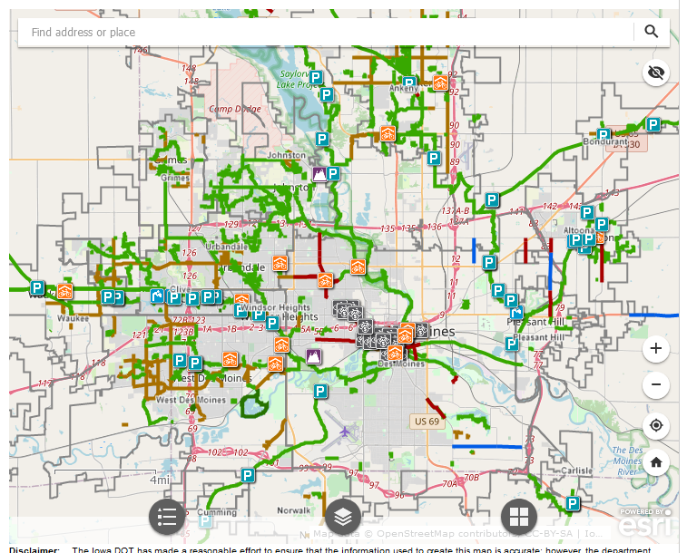
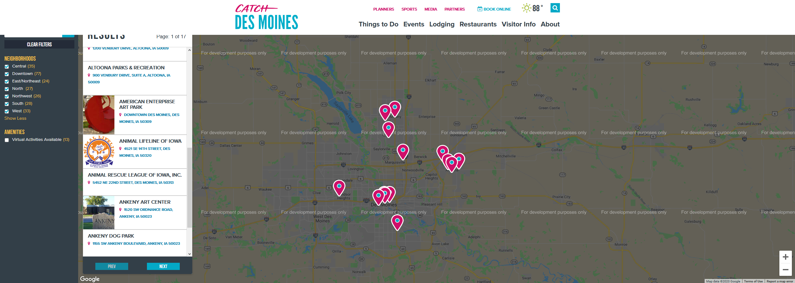

# Des Moines, Iowa Bikesharing Exploratory Project

## Summer Vacation in New York City

Kate and Grace had an extraordinary summer vacation in New York City. They visited most of the sites across in two weeks. After the trip while looking at their trip photographs, the two discovered one of the aspects that made the trip enjoyable was the cycling they did to travel across the city. Grace recognized an opportunity to bring bike-sharing to Des Moines, Iowa and use New York City as a model.

### Citi Bike

Citi Bike, a bike-share service provider selected by New York City's Department of Transportation, allows New Yorkers and visitors to commute and travel around the city. The bike-share system operates non-stop throughout the year. Citi Bike has been in operation since May, 2013 and by October of 2017, the 50 millionth trip was taken. By May, 2018, Citi Bike had over 143,000 members[[1]](#1).

#### Discussion

New York has an estimated population of 8,336,817 with a large area and Des Moines has a smaller estimated population of 214,237 with a smaller area. While Des Moines is about 81 square miles, the city's population density is just over 2,500 people per square mile; New York is 302 square miles with a poplulation density around 27,000 people per square mile[[2]](#2). Based on area alone, intracity bicycle travel should be more manageable in Des Moines. Ease of travel is further supported by the availability of bike routes. A shared paved bike path crosses the city in all directions and a bicycle lane stretching the downtown area east to west[[3]](#3). Comparing Des Moines' bike map with a tourism map of Des Moines, one can see the majority of sites suggested are in the downtown area and in biking range [[4]](#4).The seven locations of McDonalds in Des Moines also serves as an indicator of where people go in the city. All of New York's McDonalds restaurants in a five mile radius with the center in Midtown Manhattan - activity here is dense; the seven McDonalds restaurants in Des Moinse are within a 5.5 mile radius[[5]](#5). Des Moines has potential to be a successful site for a bike-share service.

#### Looking Forward

More comparisons are needed with cities that have different combinations of population, area, and bike-share companies. So far, the information from New York suggests density is the driver for success. However, Des Moines is significantly less dense and finding a smaller city with a bike-share service would be a better comparison. Other factors such as elevation and public transportation should be looked into as potential factors as well as number of tourists and urban commuters.

##### References

<a id='1'>[1]</a>
www.citibikenyc.com/about

<a id='2'>[2]</a>
https://www.census.gov/quickfacts/fact/table/newyorkcitynewyork,desmoinescityiowa/PST045219

<a id='3'>[3]</a>
https://iowadot.gov/iowabikes/bikemap/home.aspx

<a id='4'>[4]</a>
https://www.catchdesmoines.com/things-to-do/attractions/?skip=0&sort=qualityScore&regionids=122%2C123%2C124%2C125%2C126

<a id='5'>[5]</a>
Tableau Story [link to dashboard](https://public.tableau.com/views/bikesharingChallenge1/NYCDesMoines?:language=en&:display_count=y&:origin=viz_share_link)

